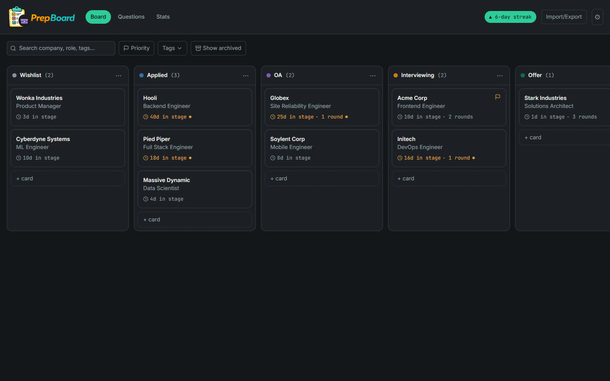
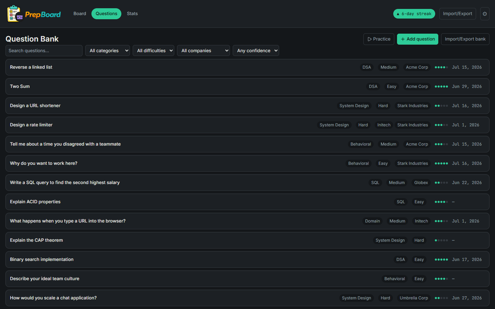
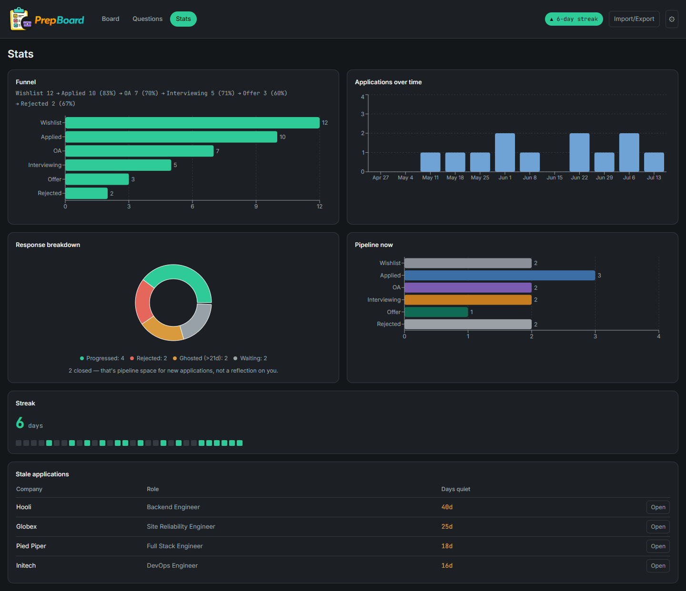

# PrepBoard


A 100% free, client-side job application and interview prep tracker. No accounts, no backend, no database, no analytics — nothing you type ever leaves your device.



## Features

- **Kanban application board** — customizable stages (rename, add, remove, reorder), drag-and-drop cards fully keyboard-operable, quick-add from any column
- **Application detail panel** — company/role/salary/tags/contacts, an auto-logged timeline of stage changes, and per-application interview round logs
- **Interview round logs** — type, date, interviewer, outcome, prep notes and post-round reflections; any question asked can be sent to the question bank with one click
- **Question bank** — searchable library of every interview question you've logged, with category, difficulty, confidence rating, and a flashcard-style **practice mode** that prioritizes your low-confidence questions
- **Stats dashboard** — funnel, response-rate breakdown, pipeline snapshot, activity streak with a heatmap, and a stale-applications callout so nothing quietly dies in your pipeline
- **JSON and CSV export/import**, fully schema-validated on import, with merge or replace-all on conflict
- **Works offline** after the first load — every asset (including fonts) is self-hosted; nothing is fetched from a CDN or third-party server, ever

## Screenshots

| Kanban board | Question bank | Stats dashboard |
| --- | --- | --- |
|  |  |  |

## Stack

Vite + React 18 + TypeScript + Tailwind CSS + Zustand + dnd-kit + Recharts. See [`docs/02-Technical-Architecture-Document.md`](docs/02-Technical-Architecture-Document.md) for the full architecture.

## Development

```bash
npm install
npm run dev      # start dev server
npm run build    # production build
npm run test     # run unit tests
npm run lint     # lint
```

## Deployment

PrepBoard is a static site — no server, no environment variables, no database. It deploys to any static host; `vercel.json` is already checked in with the recommended security headers (CSP, HSTS, `X-Frame-Options`, etc. — see [`docs/03-Security-Access-Document.md`](docs/03-Security-Access-Document.md)).

**Vercel:** import the repo at [vercel.com/new](https://vercel.com/new) — it auto-detects the Vite build (`npm run build`, output directory `dist`).

The free tier is enough — there's no backend to scale.

## Privacy

PrepBoard stores everything **only in your browser's `localStorage`**. Specifically:

- No account, no sign-in, no email collection.
- No analytics, no telemetry, no tracking scripts of any kind.
- No data — companies, notes, interview questions, contacts, or anything else you enter — is ever sent to a server. The app makes zero network requests once the page has loaded (DevTools' Network tab verified).
- "Delete all data" (in Settings) permanently clears everything from `localStorage` in one action.
- Exporting a JSON or CSV backup happens entirely on your device; nothing is uploaded anywhere.
- If your browser's storage is ever cleared (private browsing, "clear site data", a new device), your board goes with it — export a JSON backup first if you want a copy elsewhere.
